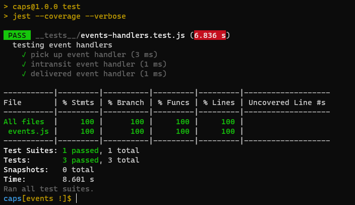
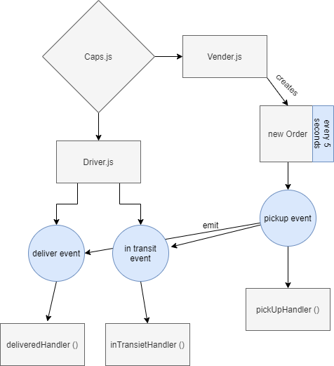

401 lab 11 Event Driven Applications
# LAB - 11 caps
## Event Driven Applications
### Author: Tamara Al-billeh

* [submission PR](https://github.com/tamaraalbilleh/caps/pulls) .
* [tests report](https://github.com/tamaraalbilleh/caps/actions) .
 
### Setup

#### `.env` requirements

- `STORE` - 'store-name'

#### Running the app

- `npm start`
- `node caps.js`

#### Tests

- Unit Tests: `npm run test`

- Lint Tests: `npm run lint`

#### UML

(Created with [diagrams](https://app.diagrams.net/))

[for more clear view](https://app.diagrams.net/#G1hM9YnAllP7O64p50CDyurRyah9Tf48bu) 